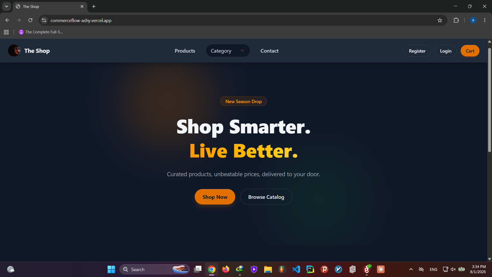
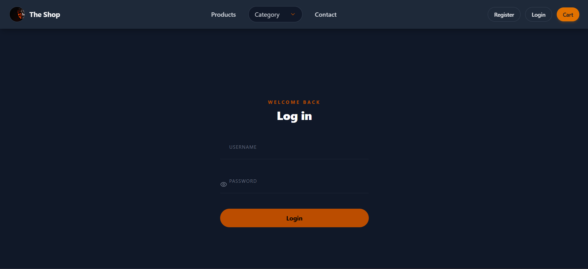
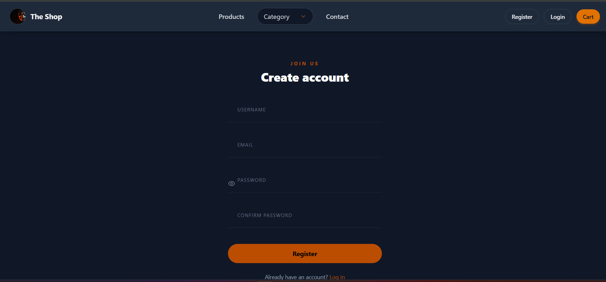
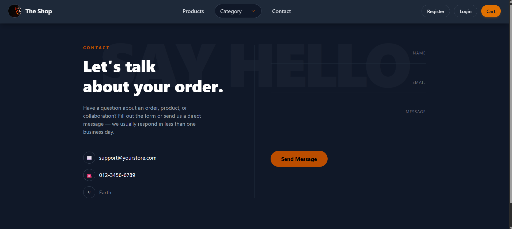

CommerceFlow

A modern full-stack e-commerce web application built with Django REST Framework and React.

Live Demo :

https://commerceflow-ashy.vercel.app/

---

Features

- User Registration & Login
- JWT Authentication
- Protected Routes
- Product Listing
- Product Details
- Product Categories
- Featured Products
- Shopping Cart
- Order Management
- Image Upload with Cloudinary
- Responsive Design
- RESTful API

---

Tech Stack

Backend

- Django
- Django REST Framework
- PostgreSQL
- JWT Authentication
- Cloudinary
- Gunicorn

Frontend

- React
- Vite
- React Router
- Axios
- Context API

Deployment

- Render (Backend)
- Vercel (Frontend)
- PostgreSQL (Render)
- Cloudinary (Media Storage)

---

Screenshots

Home Page

Login & Register

Contact

---

API Examples

Products

GET

/api/products/

Categories

GET

/api/categories/

Product Detail

GET

/api/products/{id}/

Login

POST

/api/token/

---

Installation

Backend

cd backend

python -m venv .venv

pip install -r requirements.txt

python manage.py migrate

python manage.py runserver

Frontend

cd frontend

npm install

npm run dev

---

Environment Variables

Backend

SECRET_KEY=
DATABASE_URL=

CLOUDINARY_CLOUD_NAME=
CLOUDINARY_API_KEY=
CLOUDINARY_API_SECRET=

Frontend

VITE_API_URL=

---

Project Structure

CommerceFlow/

backend/
frontend/

---

Future Improvements

- Payment Gateway Integration
- Wishlist
- Product Reviews
- Admin Dashboard Analytics
- Search Suggestions
- Email Verification
- Docker Support

---

Author

Amir
